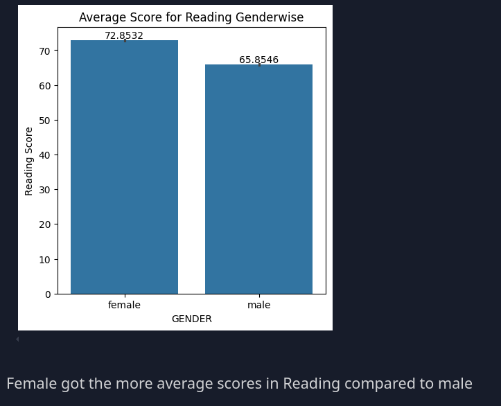
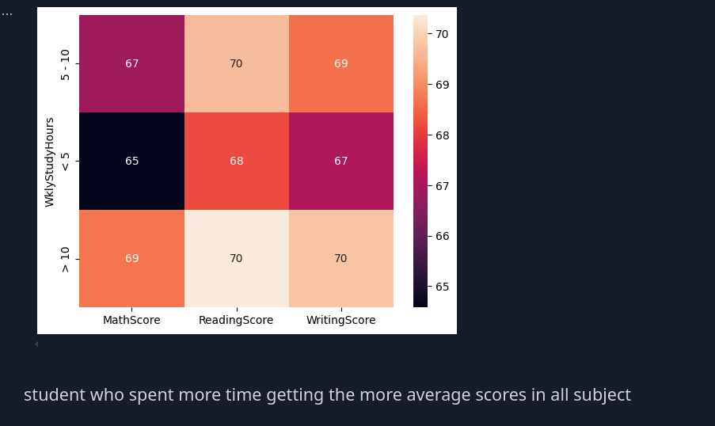

# Students score analysis

I have used a few libraries like pandas, numpy, etc to analyze these scores.

## Installation

I have also added a requirement.txt file so that someone can download this project and run the file to install all the libraries.

```bash
pip install requirements.txt
```

## Report Based on Analysis

- Number of Males and Females in the Dataset
- Males got higher average scores in math compared to Female
- Female got the more average scores in Reading compared to male
- Female got higher average scores in writing compared to male
- parents who have master's degrees, have a good impact on the performance of their children
- Students who spent more time getting higher average scores in all subjects
- the distribution of EthinicGroupZ






```bash
groupA = df.loc[(df["EthnicGroup"] == "group A")].count()
groupB = df.loc[(df["EthnicGroup"] == "group B")].count()
groupC = df.loc[(df["EthnicGroup"] == "group C")].count()
groupD = df.loc[(df["EthnicGroup"] == "group D")].count()
groupE = df.loc[(df["EthnicGroup"] == "group E")].count()

mlist=[groupA["EthnicGroup"], groupB["EthnicGroup"],groupC["EthnicGroup"],groupD["EthnicGroup"],groupE["EthnicGroup"]]
plt.pie(mlist, labels=["group A", "group B", "group C", "group D", "group E"], autopct='%1.1f%%')
plt.title("Ethnic Group Distribution")
plt.show()

```


